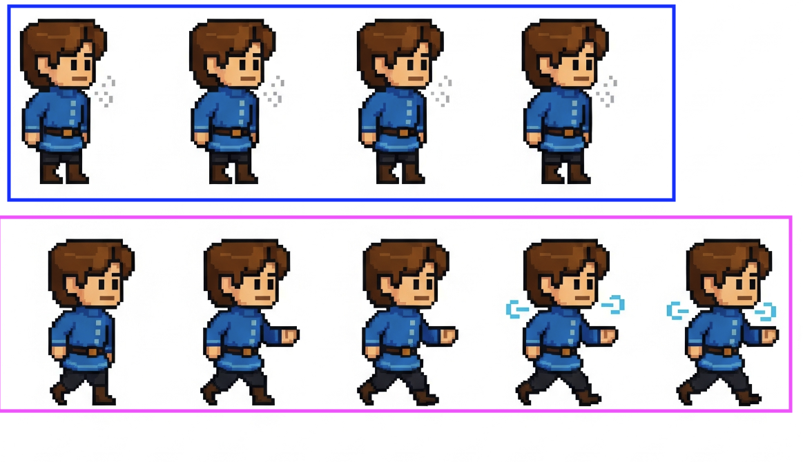

# Atlas Sprite Animation Master Class: Building the Guild Master

Welcome to this comprehensive guide on implementing atlas sprite animations in Bevy using an ECS-focused approach. We'll
build a fully animated Guild Master boss sprite using the existing `assets/bosses/guild_master.png` atlas.

## Prerequisites

- Basic understanding of Bevy and ECS concepts
- The `guild_master.png` sprite atlas (15 frames, 64x64 pixels each)
- ~10 minutes per step

## Table of Contents

1. [Understanding the Foundation](#step-1-understanding-the-foundation)
2. [Creating the Animation Component](#step-2-creating-the-animation-component)
3. [Setting Up the Atlas Layout](#step-3-setting-up-the-atlas-layout)
4. [Implementing the Spawn System](#step-4-implementing-the-spawn-system)
5. [Building the Animation System](#step-5-building-the-animation-system)
6. [Integrating with Arena System](#step-6-integrating-with-arena-system)
7. [Adding Unit Tests](#step-7-adding-unit-tests)
8. [Performance Optimization](#step-8-performance-optimization)

---

## Step 1: Understanding the Foundation

**Time: ~10 minutes**

### Current Architecture Review

Your codebase already has excellent foundations:

1. **Boss Trait** (`src/boss/mod.rs:21-46`): Defines common boss behavior
2. **GuildMaster Component** (`src/boss/guild_master.rs:4-11`): Implements the Boss trait
3. **Arena System** (`src/arena/guildhouse.rs`): Provides the parent entity structure

### Key ECS Concepts We'll Use:

- **Components**: Data containers (GuildMaster, BossAnimationConfig, TextureAtlas)
- **Systems**: Logic processors (spawn_guild_master, animate_guild_master)
- **Resources**: Shared data (AssetServer, TextureAtlasLayouts)

### Unit Test:

```rust
#[cfg(test)]
mod tests {
    use super::*;

    #[test]
    fn test_guild_master_constants() {
        assert_eq!(GuildMaster::NAME, "The Guild Master");
        assert_eq!(GuildMaster::TEXTURE_PATH, "bosses/guild_master.png");
        assert_eq!(GuildMaster::FRAME_COUNT, 15);
    }
}
```

---

## Step 2: Creating the Animation Component

**Time: ~10 minutes**

### The Component Structure

The `BossAnimationConfig` component (`src/boss/mod.rs:14-19`) stores animation state:

```rust
#[derive(Component)]
pub struct BossAnimationConfig {
    pub first_frame: usize,
    pub last_frame: usize,
    pub timer: Timer,
}
```

### Why This Design?

- **first_frame/last_frame**: Allows partial animations (e.g., frames 0-5 for idle)
- **timer**: Tracks frame timing independently per entity
- **Component-based**: Each boss can have unique animation timing
  

### Enhancement: Add Animation States

```rust
#[derive(Component, Debug, Clone, Copy, PartialEq)]
pub enum AnimationState {
    Idle,
    Attack,
    Hurt,
    Death,
}

#[derive(Component)]
pub struct AnimationController {
    pub state: AnimationState,
    pub config: BossAnimationConfig,
}
```

### Unit Test:

```rust
#[test]
fn test_animation_config_creation() {
    let config = GuildMaster::animation_config();
    assert_eq!(config.first_frame, 0);
    assert_eq!(config.last_frame, 14);
    assert_eq!(config.timer.duration().as_secs_f32(), 0.1);
}
```

---

## Step 3: Setting Up the Atlas Layout

**Time: ~10 minutes**

### About the TextureAtlasLayout Contributors

**Primary Contributor: NiklasEi** (Niklas Eicker)

- **Who**: Prolific Bevy ecosystem developer with 198+ GitHub repositories
- **Known for**: Creating essential Bevy tools including:
    - `bevy_game_template` (817⭐) - Cross-platform game template with CI/CD
    - `bevy_asset_loader` (479⭐) - Asset loading and organization
    - `bevy_kira_audio` (342⭐) - Advanced audio integration
- **Mental Space**: NiklasEi focuses on making Bevy more accessible and developer-friendly. Their PR #11783 renamed "
  TextureAtlas" to "TextureAtlasLayout" for clarity, showing their attention to API ergonomics and reducing confusion
  for newcomers.

When reading this code, think like NiklasEi: prioritize clarity, consistency, and making complex systems approachable
for all skill levels.

### Core Type Definitions

#### UVec2

`UVec2` is Bevy's unsigned integer 2D vector type, representing x and y coordinates with u32 values.

- **Source**: [
  `bevy::math::UVec2`](https://github.com/bevyengine/bevy/blob/main/crates/bevy_math/src/primitives/dim2.rs)
- **Usage**: Perfect for pixel-based coordinates where negative values don't make sense
- **Example**: `UVec2::new(64, 64)` represents a 64x64 pixel dimension

#### TextureAtlasLayout

`TextureAtlasLayout` defines how a sprite sheet is divided into individual frames.

- **Source**: [
  `bevy::sprite::TextureAtlasLayout`](https://github.com/bevyengine/bevy/blob/main/crates/bevy_sprite/src/texture_atlas.rs)
- **Purpose**: Stores the rectangles that define each sprite's boundaries within the atlas
- **Key fields**:
    - `textures: Vec<URect>` - Array of rectangles defining each frame
    - `size: UVec2` - Total dimensions of the entire atlas

#### from_grid Function

```rust
pub fn from_grid(
    tile_size: UVec2,      // Size of each individual frame
    columns: u32,          // Number of frames horizontally
    rows: u32,            // Number of frames vertically
    padding: Option<UVec2>, // Space between frames (optional)
    offset: Option<UVec2>,  // Starting offset in the texture (optional)
) -> Self
```

- **Source**: [
  `TextureAtlasLayout::from_grid`](https://github.com/bevyengine/bevy/blob/main/crates/bevy_sprite/src/texture_atlas.rs#L44)
- **Purpose**: Automatically calculates frame rectangles for grid-based sprite sheets

### Understanding the Layout Creation

The `create_atlas_layout` method (`src/boss/mod.rs:37-45`) defines how to slice the sprite sheet:

```rust
fn create_atlas_layout() -> TextureAtlasLayout {
    TextureAtlasLayout::from_grid(
        UVec2::new(Self::FRAME_WIDTH, Self::FRAME_HEIGHT),  // Cell size: 64x64 pixels
        Self::FRAME_COUNT as u32,                           // Columns: 15 frames
        1,                                                  // Rows: 1 (horizontal strip)
        None,                                               // Padding: no space between frames
        None,                                               // Offset: start at (0,0)
    )
}
```

### Visual Representation:

```
guild_master.png layout (960x64 pixels total):
┌────┬────┬────┬────┬────┬────┬────┬────┬────┬────┬────┬────┬────┬────┬────┐
│ 0  │ 1  │ 2  │ 3  │ 4  │ 5  │ 6  │ 7  │ 8  │ 9  │ 10 │ 11 │ 12 │ 13 │ 14 │
└────┴────┴────┴────┴────┴────┴────┴────┴────┴────┴────┴────┴────┴────┴────┘
  64px each frame →
```

### ECS Integration: Understanding Handle<T> and Assets<T>

### [Ref: Understanding Handle Vs Assets](understanding_handle_and_assets.md)

#### Practical Usage Pattern: Guild Master Implementation

```rust
// PATTERN 1: Create Atlas Layout (Your Boss::create_atlas_layout)
impl Boss for GuildMaster {
    fn create_atlas_layout() -> TextureAtlasLayout {
        TextureAtlasLayout::from_grid(
            UVec2::new(Self::FRAME_WIDTH, Self::FRAME_HEIGHT), // 64x64 pixels
            Self::FRAME_COUNT as u32,                          // 15 frames
            1,                                                 // 1 row
            None,                                              // No padding
            None,                                              // No offset
        )
    }
}

// PATTERN 2: Spawn Guild Master with Atlas (Bevy 0.16 syntax)
fn spawn_guild_master(
    mut commands: Commands,
    asset_server: Res<AssetServer>,
    mut layouts: ResMut<Assets<TextureAtlasLayout>>,
    query: Query<Entity, With<GuildHouse>>,
) {
    let Some(arena_entity) = query.iter().next() else {
        return;
    };

    // Load texture and create layout
    let texture = asset_server.load(GuildMaster::TEXTURE_PATH);
    let layout = layouts.add(GuildMaster::create_atlas_layout());

    // Spawn as child of GuildHouse arena
    commands.entity(arena_entity).with_children(|parent| {
        parent.spawn((
            GuildMaster,
            // Bevy 0.16: Individual components instead of SpriteBundle
            Sprite::from_image(texture),
            Transform::from_xyz(0.0, 0.0, 1.0), // Center of arena
            TextureAtlas {
                layout: layout.clone(), // Handle cloning is cheap!
                index: 0,
            },
            GuildMaster::animation_config(),
        ));
    });
}

// PATTERN 3: Resource-based Atlas Sharing (for multiple bosses)
#[derive(Resource)]
pub struct GuildMasterAssets {
    pub texture: Handle<Image>,
    pub atlas_layout: Handle<TextureAtlasLayout>,
}

fn setup_guild_master_assets(
    mut commands: Commands,
    asset_server: Res<AssetServer>,
    mut layouts: ResMut<Assets<TextureAtlasLayout>>,
) {
    // Create assets ONCE and store in resource
    let texture = asset_server.load(GuildMaster::TEXTURE_PATH);
    let atlas_layout = layouts.add(GuildMaster::create_atlas_layout());

    commands.insert_resource(GuildMasterAssets {
        texture,
        atlas_layout,
    });
}

// PATTERN 4: Using shared assets (for spawning multiple guild masters)
fn spawn_multiple_guild_masters(
    mut commands: Commands,
    assets: Res<GuildMasterAssets>,
    arenas: Query<Entity, With<GuildHouse>>,
) {
    for arena_entity in &arenas {
        commands.entity(arena_entity).with_children(|parent| {
            parent.spawn((
                GuildMaster,
                Sprite::from_image(assets.texture.clone()),
                Transform::from_xyz(0.0, 0.0, 1.0),
                TextureAtlas {
                    layout: assets.atlas_layout.clone(), // Same layout, shared!
                    index: 0,
                },
                GuildMaster::animation_config(),
            ));
        });
    }
}

// PATTERN 5: Check atlas readiness in animation system
fn animate_guild_master_when_ready(
    time: Res<Time>,
    atlases: Res<Assets<TextureAtlasLayout>>,
    mut query: Query<
        (&mut TextureAtlas, &mut BossAnimationConfig),
        With<GuildMaster>
    >,
) {
    for (mut atlas, mut config) in &mut query {
        // Verify atlas is loaded before animating
        if atlases.get(&atlas.layout).is_none() {
            continue; // Skip if atlas not ready
        }

        config.timer.tick(time.delta());
        if config.timer.just_finished() {
            atlas.index = if atlas.index >= config.last_frame {
                config.first_frame
            } else {
                atlas.index + 1
            };
        }
    }
}
```

### Enhanced Unit Tests

```rust
#[test]
fn test_atlas_layout_dimensions() {
    let layout = GuildMaster::create_atlas_layout();

    // Test 1: Verify total atlas dimensions
    assert_eq!(
        layout.size,
        UVec2::new(960, 64),
        "Atlas size should be 960x64 (15 frames * 64px width, 64px height)"
    );
}

#[test]
fn test_atlas_frame_count() {
    let layout = GuildMaster::create_atlas_layout();

    // Test 2: Verify the total number of frames in the layout
    assert_eq!(
        layout.textures.len(),
        15,
        "Atlas should contain exactly 15 frames for all animation states"
    );
}

#[test]
fn test_individual_frame_dimensions() {
    let layout = GuildMaster::create_atlas_layout();

    // Test 3: Verify the size of an individual frame's rectangle
    let first_frame = &layout.textures[0];
    assert_eq!(
        first_frame.size(),
        UVec2::new(64, 64),
        "Each frame should be exactly 64x64 pixels"
    );

    // Verify frame positioning
    assert_eq!(
        first_frame.min,
        UVec2::new(0, 0),
        "First frame should start at origin (0,0)"
    );

    let last_frame = &layout.textures[14];
    assert_eq!(
        last_frame.min,
        UVec2::new(896, 0),
        "Last frame should start at x=896 (14 * 64)"
    );
}

#[test]
fn test_frame_boundaries() {
    let layout = GuildMaster::create_atlas_layout();

    // Verify no overlap between frames
    for i in 0..layout.textures.len() - 1 {
        let current = &layout.textures[i];
        let next = &layout.textures[i + 1];

        assert_eq!(
            current.max.x,
            next.min.x,
            "Frame {} should end exactly where frame {} begins", i, i + 1
        );
    }
}
```

### What These Tests Prove

1. **test_atlas_layout_dimensions**: Ensures the sprite sheet is correctly sized for 15 frames at 64x64 pixels each
2. **test_atlas_frame_count**: Verifies we have exactly the expected number of animation frames
3. **test_individual_frame_dimensions**: Confirms each frame is the correct size and positioned correctly
4. **test_frame_boundaries**: Ensures frames don't overlap or have gaps between them

These tests catch common atlas configuration errors:

- Wrong frame size causing animation bleeding
- Incorrect frame count causing index out of bounds
- Positioning errors causing visual glitches
- Overlap issues causing frames to show parts of adjacent frames

---

## Step 4: Implementing the Spawn System

**Time: ~10 minutes**

### The Spawn System

This system creates the Guild Master entity with all necessary components:

```rust
fn spawn_guild_master(
    mut commands: Commands,
    asset_server: Res<AssetServer>,
    mut layouts: ResMut<Assets<TextureAtlasLayout>>,
    query: Query<Entity, With<GuildHouse>>,
) {
    let Some(arena_entity) = query.iter().next() else {
        return;
    };

    let texture = asset_server.load(GuildMaster::TEXTURE_PATH);
    let layout = layouts.add(GuildMaster::create_atlas_layout());

    commands.entity(arena_entity).with_children(|parent| {
        parent.spawn((
            GuildMaster,
            SpriteBundle {
                texture,
                transform: Transform::from_xyz(0.0, 0.0, 1.0), // Center of arena
                ..default()
            },
            TextureAtlas {
                layout,
                index: 0,
            },
            GuildMaster::animation_config(),
        ));
    });
}
```

### Key ECS Patterns:

1. **Resource Access**: `AssetServer`, `Assets<TextureAtlasLayout>`
2. **Query**: Find the parent GuildHouse entity
3. **Entity Hierarchy**: Spawn as child of arena
4. **Component Bundle**: Combine multiple components atomically

### Unit Test:

```rust
#[test]
fn test_spawn_system() {
    let mut app = App::new();
    app.add_plugins(MinimalPlugins);

    // Spawn arena first
    let arena_id = app.world.spawn(GuildHouse).id();

    // Run spawn system
    app.add_systems(Update, spawn_guild_master);
    app.update();

    // Verify guild master spawned as child
    let children = app.world.get::<Children>(arena_id).unwrap();
    assert_eq!(children.len(), 1);
}
```

---

## Step 5: Building the Animation System

**Time: ~10 minutes**

### The Animation System

This system updates the sprite's atlas index based on time:

```rust
fn animate_guild_master(
    time: Res<Time>,
    mut query: Query<
        (&mut TextureAtlas, &mut BossAnimationConfig),
        With<GuildMaster>
    >,
) {
    for (mut atlas, mut config) in &mut query {
        config.timer.tick(time.delta());

        if config.timer.just_finished() {
            atlas.index = if atlas.index >= config.last_frame {
                config.first_frame
            } else {
                atlas.index + 1
            };
        }
    }
}
```

### ECS Benefits:

- **Parallel Processing**: Multiple bosses animate independently
- **Component Filtering**: Only animates GuildMaster entities
- **Time Resource**: Consistent frame-independent animation

### Enhanced Version with States:

```rust
fn animate_with_states(
    time: Res<Time>,
    mut query: Query<
        (&mut TextureAtlas, &mut AnimationController),
        With<GuildMaster>
    >,
) {
    for (mut atlas, mut controller) in &mut query {
        controller.config.timer.tick(time.delta());

        if controller.config.timer.just_finished() {
            let (first, last) = match controller.state {
                AnimationState::Idle => (0, 4),
                AnimationState::Attack => (5, 9),
                AnimationState::Hurt => (10, 12),
                AnimationState::Death => (13, 14),
            };

            atlas.index = if atlas.index >= last {
                first
            } else {
                atlas.index + 1
            };
        }
    }
}
```

### Unit Test:

```rust
#[test]
fn test_animation_loop() {
    let mut atlas = TextureAtlas { layout: Handle::default(), index: 0 };
    let mut config = GuildMaster::animation_config();

    // Simulate reaching last frame
    atlas.index = 14;
    config.timer.tick(Duration::from_secs_f32(0.1));

    // Should loop back to first frame
    if config.timer.just_finished() {
        atlas.index = 0;
    }

    assert_eq!(atlas.index, 0);
}
```

---

## Step 6: Integrating with Arena System

**Time: ~10 minutes**

### Plugin Architecture

Create a cohesive plugin to manage the Guild Master lifecycle:

```rust
pub struct GuildMasterPlugin;

impl Plugin for GuildMasterPlugin {
    fn build(&self, app: &mut App) {
        app
            .add_systems(OnEnter(GameState::Arena), spawn_guild_master)
            .add_systems(
                Update,
                animate_guild_master.run_if(in_state(GameState::Arena))
            )
            .add_systems(OnExit(GameState::Arena), despawn_guild_master);
    }
}

fn despawn_guild_master(
    mut commands: Commands,
    query: Query<Entity, With<GuildMaster>>,
) {
    for entity in &query {
        commands.entity(entity).despawn_recursive();
    }
}
```

### System Ordering:

```rust
app.add_systems(
Update,
(
spawn_guild_master,
animate_guild_master,
).chain() // Ensures spawn happens before animation
);
```

### Unit Test:

```rust
#[test]
fn test_plugin_systems() {
    let mut app = App::new();
    app.add_plugins((MinimalPlugins, GuildMasterPlugin));

    // Verify systems are registered
    let schedule = app.world.resource::<Schedules>();
    assert!(schedule.contains(OnEnter(GameState::Arena)));
}
```

---

## Step 7: Adding Unit Tests

**Time: ~10 minutes**

### Comprehensive Test Suite

```rust
#[cfg(test)]
mod guild_master_tests {
    use super::*;
    use bevy::app::App;

    #[test]
    fn test_complete_animation_cycle() {
        let mut app = App::new();
        app.add_plugins(MinimalPlugins);

        // Setup
        let guild_house = app.world.spawn(GuildHouse).id();

        // Spawn
        app.add_systems(Startup, spawn_guild_master);
        app.update();

        // Verify hierarchy
        let children = app.world.get::<Children>(guild_house).unwrap();
        let guild_master = children[0];

        // Verify components
        assert!(app.world.get::<GuildMaster>(guild_master).is_some());
        assert!(app.world.get::<TextureAtlas>(guild_master).is_some());
        assert!(app.world.get::<BossAnimationConfig>(guild_master).is_some());
    }

    #[test]
    fn test_animation_timing() {
        let mut timer = Timer::from_seconds(0.1, TimerMode::Repeating);

        // Test 15 frames at 10 FPS = 1.5 seconds per cycle
        for _ in 0..15 {
            timer.tick(Duration::from_secs_f32(0.1));
            assert!(timer.just_finished());
        }
    }

    #[test]
    fn test_texture_atlas_bounds() {
        let layout = GuildMaster::create_atlas_layout();

        // Verify all frame indices are valid
        for i in 0..15 {
            assert!(i < layout.textures.len());
        }
    }
}
```

### Integration Test:

```rust
#[test]
fn test_full_spawn_animate_cycle() {
    let mut app = App::new();
    app
        .add_plugins(DefaultPlugins)
        .add_systems(Startup, spawn_guild_master)
        .add_systems(Update, animate_guild_master);

    // Run for 2 seconds (20 frames at 10 FPS)
    for _ in 0..20 {
        app.update();
        std::thread::sleep(Duration::from_millis(100));
    }

    // Verify animation progressed
    let query = app.world.query::<&TextureAtlas>();
    for atlas in query.iter(&app.world) {
        assert!(atlas.index > 0); // Should have animated
    }
}
```

---

## Step 8: Performance Optimization

**Time: ~10 minutes**

### Optimization Strategies

#### 1. Texture Atlas Caching

```rust
#[derive(Resource)]
struct AtlasCache {
    layouts: HashMap<&'static str, Handle<TextureAtlasLayout>>,
}

fn setup_atlas_cache(mut commands: Commands) {
    commands.insert_resource(AtlasCache {
        layouts: HashMap::new(),
    });
}
```

#### 2. System Batching

```rust
fn animate_all_bosses(
    time: Res<Time>,
    mut query: Query<(&mut TextureAtlas, &mut BossAnimationConfig)>,
) {
    // Process all animated entities in one system
    query.par_iter_mut().for_each(|(mut atlas, mut config)| {
        config.timer.tick(time.delta());
        if config.timer.just_finished() {
            atlas.index = (atlas.index + 1) % (config.last_frame + 1);
        }
    });
}
```

#### 3. Conditional System Running

```rust
app.add_systems(
Update,
animate_guild_master
.run_if(any_with_component::<GuildMaster>)
.run_if(in_state(GameState::Arena))
);
```

### Performance Test:

```rust
#[test]
fn benchmark_animation_system() {
    let mut app = App::new();

    // Spawn 100 guild masters
    for _ in 0..100 {
        app.world.spawn((
            GuildMaster,
            TextureAtlas::default(),
            GuildMaster::animation_config(),
        ));
    }

    let start = std::time::Instant::now();

    // Run animation for 1000 frames
    for _ in 0..1000 {
        animate_all_bosses.run((), &mut app.world);
    }

    let elapsed = start.elapsed();
    println!("1000 frames with 100 entities: {:?}", elapsed);
    assert!(elapsed < Duration::from_secs(1)); // Should be very fast
}
```

---

## Advanced Topics

### Multi-State Animations

```rust
impl GuildMaster {
    fn animation_ranges() -> HashMap<AnimationState, (usize, usize)> {
        HashMap::from([
            (AnimationState::Idle, (0, 4)),
            (AnimationState::Attack, (5, 9)),
            (AnimationState::Hurt, (10, 12)),
            (AnimationState::Death, (13, 14)),
        ])
    }
}
```

### Event-Driven Animation Changes

```rust
#[derive(Event)]
struct ChangeAnimationState {
    entity: Entity,
    new_state: AnimationState,
}

fn handle_animation_events(
    mut events: EventReader<ChangeAnimationState>,
    mut query: Query<&mut AnimationController>,
) {
    for event in events.read() {
        if let Ok(mut controller) = query.get_mut(event.entity) {
            controller.state = event.new_state;
        }
    }
}
```

### Animation Blending

```rust
#[derive(Component)]
struct AnimationBlend {
    from_state: AnimationState,
    to_state: AnimationState,
    blend_timer: Timer,
}
```

---

## Complete Example Integration

Here's how everything comes together in your main.rs:

```rust
// In main.rs
use boss::GuildMasterPlugin;

fn main() {
    App::new()
        .add_plugins(DefaultPlugins)
        .add_plugins(GameStatePlugin)
        .add_plugins(GuildMasterPlugin) // Add this line
        .run();
}
```

---

## Debugging Tips

### Visual Debug Mode

```rust
fn debug_animation_info(
    query: Query<(&TextureAtlas, &BossAnimationConfig), With<GuildMaster>>,
) {
    for (atlas, config) in &query {
        info!(
            "Frame: {}/{}, Timer: {:.2}s",
            atlas.index,
            config.last_frame,
            config.timer.elapsed_secs()
        );
    }
}
```

### Common Issues and Solutions

1. **Animation not playing**: Check timer mode is `Repeating`
2. **Wrong frame order**: Verify atlas layout matches sprite sheet
3. **Performance issues**: Use `par_iter_mut()` for multiple entities
4. **Texture not loading**: Ensure path is relative to assets folder

---

## Summary

This tutorial demonstrated how to create a robust, ECS-focused atlas animation system in Bevy. Key takeaways:

1. **Component Design**: Keep animation data separate and reusable
2. **System Architecture**: Small, focused systems that do one thing well
3. **Resource Management**: Efficient texture atlas handling
4. **Testing**: Comprehensive unit tests for each component
5. **Performance**: Optimize for multiple animated entities

The Guild Master now animates smoothly in the center of the GuildHouse arena, demonstrating the power of Bevy's ECS
architecture for game development.

## Next Steps

- Implement animation states for different boss behaviors
- Add particle effects synchronized with animations
- Create animation events for sound triggers
- Build a visual animation editor using Bevy's UI system