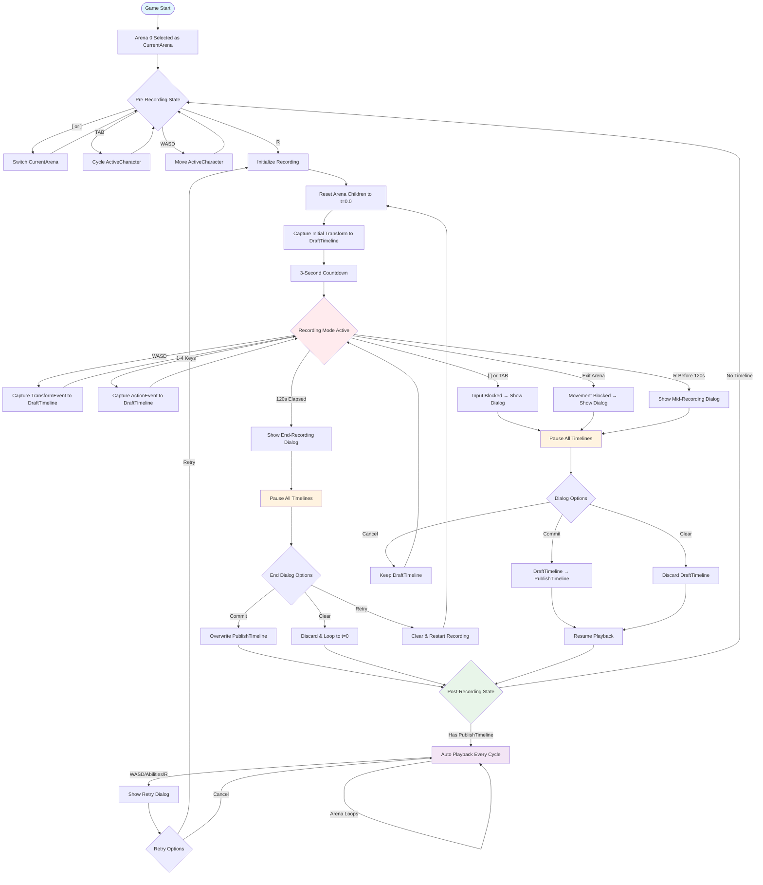
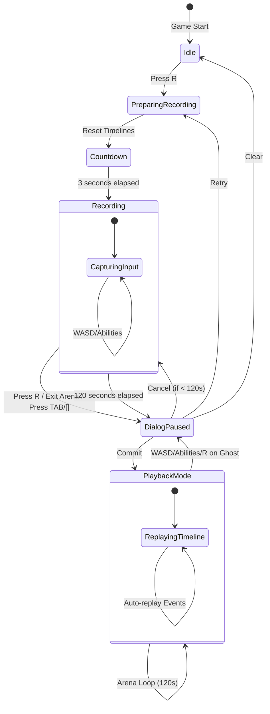
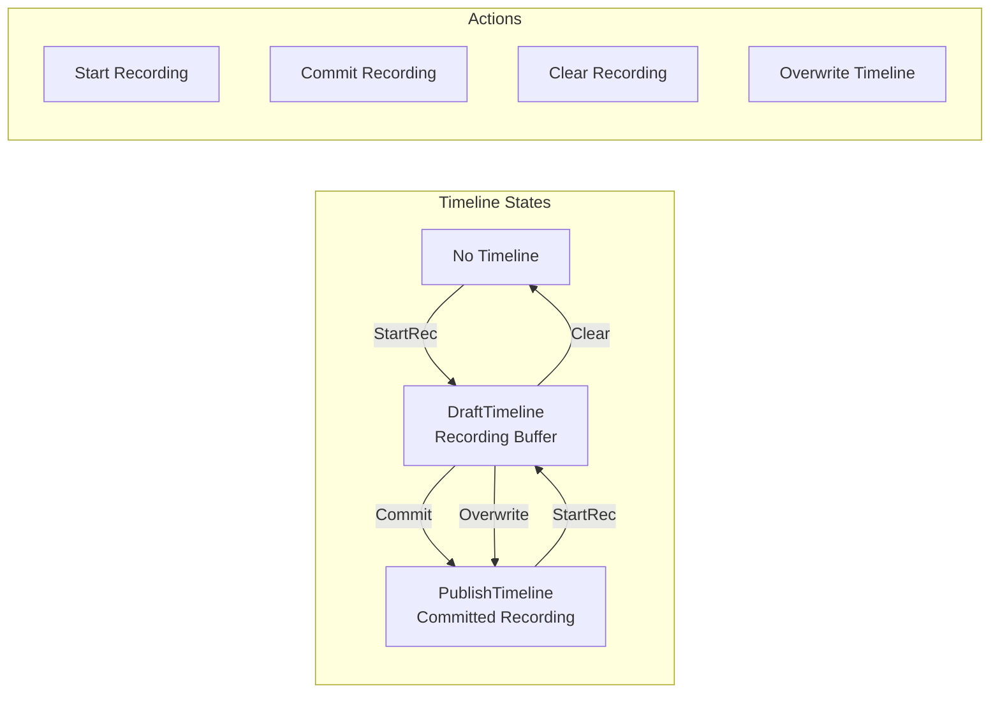
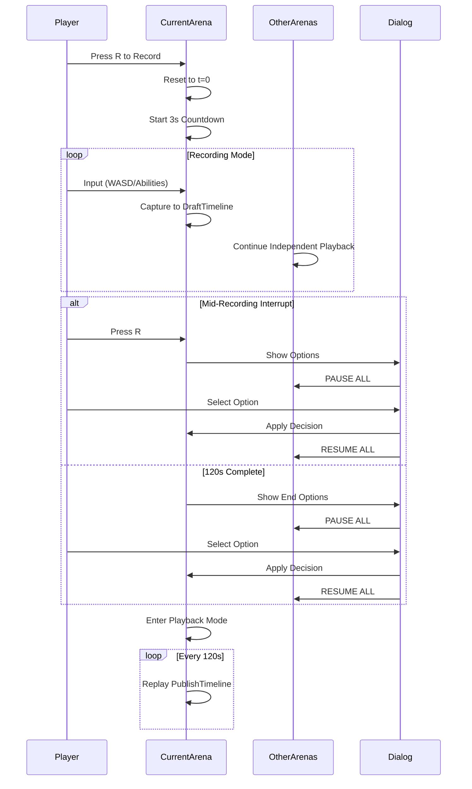
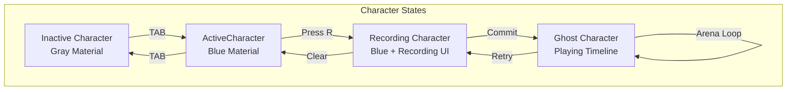

# Recording System Flow Diagram

```mermaid
flowchart TD
    Start([Game Start]) --> Init[Arena 0 Selected as CurrentArena]
    
    Init --> PreRecord{Pre-Recording State}
    
    PreRecord -->|"[ or ]"| SwitchArena[Switch CurrentArena]
    PreRecord -->|TAB| SwitchChar[Cycle ActiveCharacter]
    PreRecord -->|WASD| MoveChar[Move ActiveCharacter]
    PreRecord -->|R| InitRecord[Initialize Recording]
    
    SwitchArena --> PreRecord
    SwitchChar --> PreRecord
    MoveChar --> PreRecord
    
    InitRecord --> ResetTimeline[Reset Arena Children to t=0.0]
    ResetTimeline --> CaptureInit[Capture Initial Transform to DraftTimeline]
    CaptureInit --> Countdown[3-Second Countdown]
    Countdown --> RecordMode{Recording Mode Active}
    
    RecordMode -->|WASD| CaptureMove[Capture TransformEvent to DraftTimeline]
    RecordMode -->|"1-4 Keys"| CaptureAbility[Capture ActionEvent to DraftTimeline]
    RecordMode -->|"[ ] or TAB"| BlockedInput1[Input Blocked → Show Dialog]
    RecordMode -->|Exit Arena| BlockedMove[Movement Blocked → Show Dialog]
    RecordMode -->|R Before 120s| MidDialog[Show Mid-Recording Dialog]
    RecordMode -->|120s Elapsed| EndDialog[Show End-Recording Dialog]
    
    CaptureMove --> RecordMode
    CaptureAbility --> RecordMode
    
    BlockedInput1 --> DialogPause1[Pause All Timelines]
    BlockedMove --> DialogPause1
    MidDialog --> DialogPause1
    
    DialogPause1 --> MidOptions{Dialog Options}
    MidOptions -->|Commit| CommitMid[DraftTimeline → PublishTimeline]
    MidOptions -->|Clear| ClearMid[Discard DraftTimeline]
    MidOptions -->|Cancel| CancelMid[Keep DraftTimeline]
    
    CommitMid --> Resume1[Resume Playback]
    ClearMid --> Resume1
    CancelMid --> RecordMode
    
    EndDialog --> DialogPause2[Pause All Timelines]
    DialogPause2 --> EndOptions{End Dialog Options}
    
    EndOptions -->|Commit| CommitEnd[Overwrite PublishTimeline]
    EndOptions -->|Clear| ClearEnd[Discard & Loop to t=0]
    EndOptions -->|Retry| RetryEnd[Clear & Restart Recording]
    
    CommitEnd --> PostRecord{Post-Recording State}
    ClearEnd --> PostRecord
    RetryEnd --> ResetTimeline
    Resume1 --> PostRecord
    
    PostRecord -->|Has PublishTimeline| GhostPlay[Auto Playback Every Cycle]
    PostRecord -->|No Timeline| PreRecord
    
    GhostPlay -->|"WASD/Abilities/R"| InterceptInput[Show Retry Dialog]
    InterceptInput --> RetryDialog{Retry Options}
    
    RetryDialog -->|Retry| InitRecord
    RetryDialog -->|Cancel| GhostPlay
    
    GhostPlay -->|Arena Loops| GhostPlay
    
    style Start fill:#e1f5fe
    style RecordMode fill:#ffebee
    style PostRecord fill:#e8f5e9
    style DialogPause1 fill:#fff3e0
    style DialogPause2 fill:#fff3e0
    style GhostPlay fill:#f3e5f5
```

## State Flow Diagram

```mermaid
stateDiagram-v2
    [*] --> Idle: Game Start
    
    Idle --> PreparingRecording: Press R
    PreparingRecording --> Countdown: Reset Timelines
    Countdown --> Recording: 3 seconds elapsed
    
    Recording --> DialogPaused: Press R / Exit Arena / Press TAB/[]
    Recording --> DialogPaused: 120 seconds elapsed
    DialogPaused --> Recording: Cancel (if < 120s)
    DialogPaused --> Idle: Clear
    DialogPaused --> PlaybackMode: Commit
    DialogPaused --> PreparingRecording: Retry
    
    PlaybackMode --> DialogPaused: WASD/Abilities/R on Ghost
    PlaybackMode --> PlaybackMode: Arena Loop (120s)
    
    state Recording {
        [*] --> CapturingInput
        CapturingInput --> CapturingInput: WASD/Abilities
    }
    
    state PlaybackMode {
        [*] --> ReplayingTimeline
        ReplayingTimeline --> ReplayingTimeline: Auto-replay Events
    }
```

## Timeline Lifecycle Diagram

```mermaid
graph LR
    subgraph "Timeline States"
        Empty[No Timeline]
        Draft[DraftTimeline<br/>Recording Buffer]
        Published[PublishTimeline<br/>Committed Recording]
    end
    
    subgraph "Actions"
        StartRec[Start Recording]
        Commit[Commit Recording]
        Clear[Clear Recording]
        Overwrite[Overwrite Timeline]
    end
    
    Empty -->|StartRec| Draft
    Draft -->|Commit| Published
    Draft -->|Clear| Empty
    Published -->|StartRec| Draft
    Draft -->|Overwrite| Published
```

## Arena Synchronization Diagram

```mermaid
sequenceDiagram
    participant Player
    participant CurrentArena
    participant OtherArenas
    participant Dialog
    
    Player->>CurrentArena: Press R to Record
    CurrentArena->>CurrentArena: Reset to t=0
    CurrentArena->>CurrentArena: Start 3s Countdown
    
    loop Recording Mode
        Player->>CurrentArena: Input (WASD/Abilities)
        CurrentArena->>CurrentArena: Capture to DraftTimeline
        OtherArenas->>OtherArenas: Continue Independent Playback
    end
    
    alt Mid-Recording Interrupt
        Player->>CurrentArena: Press R
        CurrentArena->>Dialog: Show Options
        Dialog->>OtherArenas: PAUSE ALL
        Player->>Dialog: Select Option
        Dialog->>CurrentArena: Apply Decision
        Dialog->>OtherArenas: RESUME ALL
    else 120s Complete
        CurrentArena->>Dialog: Show End Options
        Dialog->>OtherArenas: PAUSE ALL
        Player->>Dialog: Select Option
        Dialog->>CurrentArena: Apply Decision
        Dialog->>OtherArenas: RESUME ALL
    end
    
    CurrentArena->>CurrentArena: Enter Playback Mode
    loop Every 120s
        CurrentArena->>CurrentArena: Replay PublishTimeline
    end
```

## Character State Transitions

```mermaid
graph TD
    subgraph "Character States"
        Inactive[Inactive Character<br/>Gray Material]
        Active[ActiveCharacter<br/>Blue Material]
        Recording[Recording Character<br/>Blue + Recording UI]
        Ghost[Ghost Character<br/>Playing Timeline]
    end
    
    Inactive -->|TAB| Active
    Active -->|TAB| Inactive
    Active -->|Press R| Recording
    Recording -->|Commit| Ghost
    Recording -->|Clear| Active
    Ghost -->|Retry| Recording
    Ghost -->|Arena Loop| Ghost
```